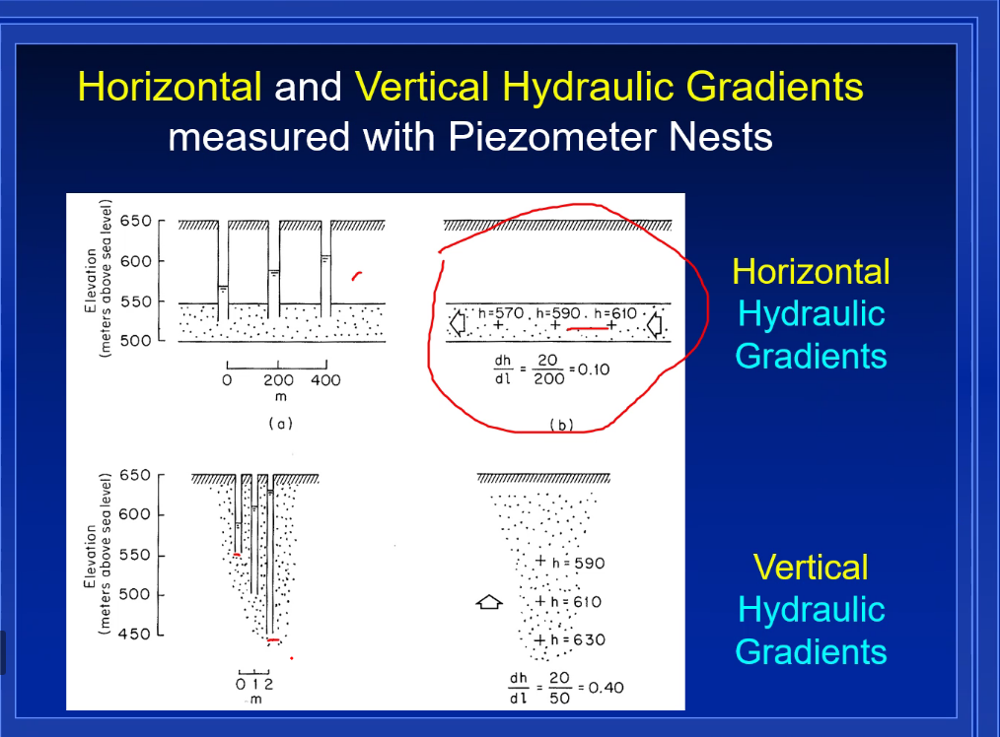
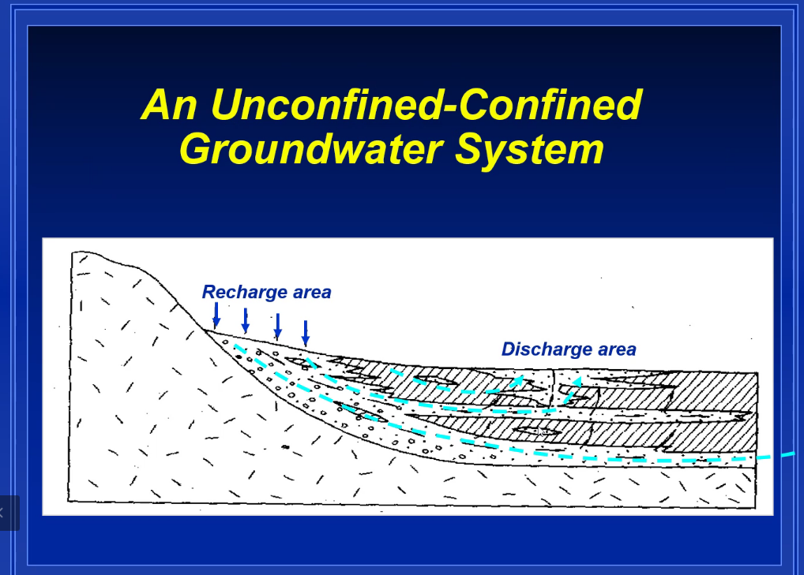
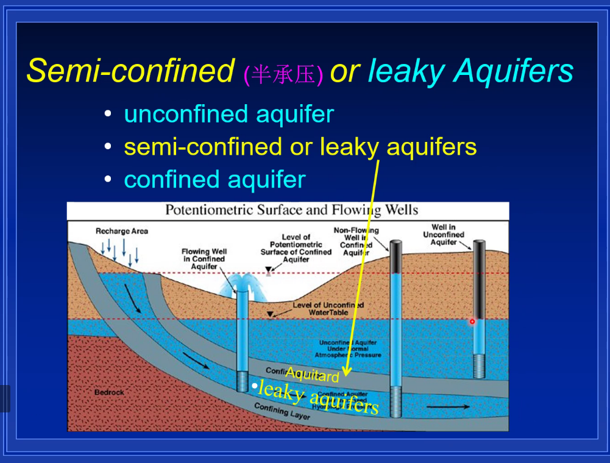

**承压含水层基本微分方程**

throughfall净降水量

baseflow 激流

streamflow 径流，河流流量，河川流量

runoff flow径流

# 1. Darcy's law

hydraulic head

hydraulic gradient

seepage velocity 渗透速率
$$
Q=-KAI=-KA\frac{dh}{dl}
$$

$$
v=KI
$$

gravity 重力势

pressure gradient 压力梯度

kinetic energy 动能

gravitational potential energy

fluid pressural energy

#### 理想流体，管道流，伯努利方程

$$
\Phi=gz+\frac{P}{\rho}+\frac{v^2}{2}
$$

把机械能除以g，单位重量的机械能
$$
\Phi=z+\frac{P}{\rho g}+\frac{v^2}{2g}
$$

elevation head

pressure head

velocity head
$$
Q=KA\frac{\Delta h}{L}
$$

10m water head---> 8m

reason: 粘滞力

seepage velocity is usually small, velocity head can be ignored

#### hydrualic head

Piezometer测压计

tensiometer张力计

tube

pipe

datum：基准点

通常以海平面作为基准点
$$
h=z+\tau
$$
$h(x,y,z,t)$

地下水的流动只与总水头有关，与压力和重力水头单一无关。

Aquiclude弱透水层

flowing aresain well 自流井

aresain spring自流泉

fresh water head

density is larger

the pressure head is lower

fresh water vs. saltwater

vs. 

versus对抗，对应

20cm的海水水头相当于20.5cm的淡水水头

Measure hydrualic head in field

datum基准点

water table depth 地下水埋深

地下水位越高，埋深越低

井口高程

$$
h=z_c=d_{wt}
$$

#### hydrualic gradient

流线与水头等值线垂直

水沿着水头下降最大的方向流动

至少三口井才能确定地下水的唯一流向

##### 水力梯度的确定方法

等水头线都是平行的

水力梯度是矢量

水向下流

seepage velocity

Darcy velocity

### 含水层的分布

capillary fringe

毛细上升带

土壤含水率=体积含水率=土壤湿度
$$
\theta=\frac{V_w}{V}
$$
在非饱和带中

$\theta<孔隙度$

饱和带

$\theta=孔隙度$

实际的土壤含水率在非饱和带中的分布

饱和和非饱和带的水头分布

饱和带压力水头小于0

非饱和带压力水头大于0

capillary fringe毛细带

支持毛细力

管子越细，上升越高

毛细上升如果高，根系则可以吸水多

蒸散发也越多

Aquifer含水层

Aquitard弱透水层

perched water-table aquifer

上层滞水

unconfined aquifer潜水含水层

confined aquifer承压含水层

湿润地区

潜水含水层易受污染

confined bed承压板=aquitard

benath在……下方，在什么下面

alluvium fans冲积扇

canyon峡谷

承压含水层的给水系数小于潜水含水层

SW basin

Surface water basin

承压含水层矿化度高，盐分高

流域边界

潜水含水层的水位和地形基本一致

地表水像相当于潜水含水层的露头

mimics topography

模仿地形

subdued 克制，征服、克服、控制

leaky aquifer 越流含水层 = semi-confined aquifer 半承压含水层

